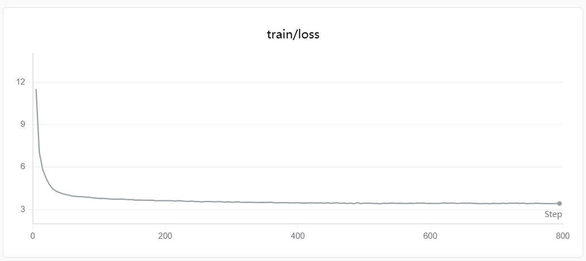
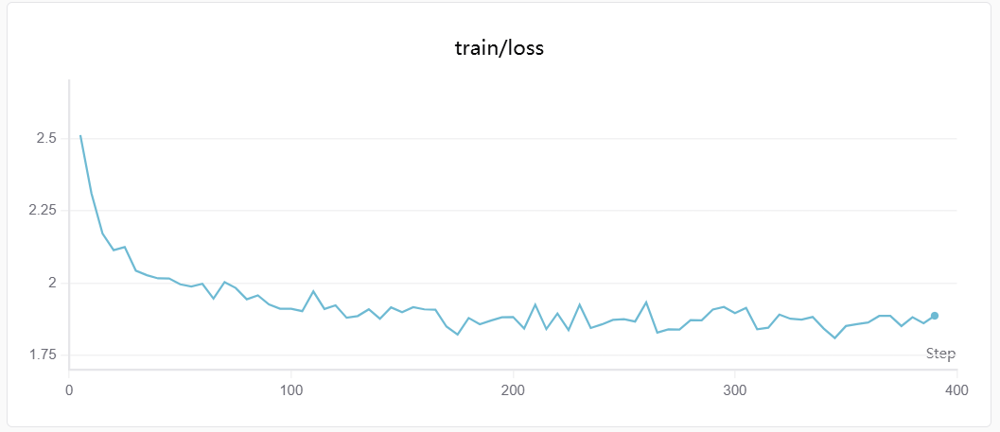

# Qwen3-"VL": The "Splice-and-Finetune" Journey Toward an Ultra-Small Chinese Multimodal Model 🤏

<div align="center">
  <figure>
  
  <figcaption>I have a Qwen, I have a SmolVLM...</figcaption>
  </figure>
</div>

## Introduction

The Hugging Face team has released SmolVLM2, an ultra-small multimodal model that can perform on-device inference with 1 GB of GPU memory. As I believe, AI should be accessible to everyone. Recent effort has mostly fallen on the state-of-the-art mega-model with multi-billion or even trillion parameters. While those models have more intelligence, they are not suitable for consumer device or environment with limited resources like personal phone. The new SmolVLM2 is very powerful and efficient for resource-constraint environment. However, it was not trained on Chinese material and can not understand Chinese. For my personal interest, I decide to splice the open-source compact language model Qwen3 and SmolVLM2 together to help SmolVLM2 work in Chinese context.

This tutorial introduces an end-to-end model-splicing solution: merging SmolVLM2's vision module (0.09B) with the smallest Qwen3 language model (0.6B) and training to align them, ultimately giving the Qwen3 model a certain degree of visual understanding capability. 


## Background on SmolVLM2

First, let us review how SmolVLM2 is built. The overall SmolVLM2 model consists of three major parts: a vision tower, a modality projection layer, and a large language backbone, as shown in the figure below.

<div align="center">
  <figure>
  
  <figcaption>Architecture of SmolVLM2</figcaption>
  </figure>
</div>

This design is a fairly common VLM architecture. The core idea is to directly concatenate the output features of the vision model with the embedded text features and then feed them into the language model (LLM), without modules such as cross-attention. Compared with earlier architectures such as LLaVA, the biggest advantage of this approach is that it can reuse existing language models to the greatest extent. Taking Qwen2.5-VL as an example, the 3B, 7B, and 72B model sizes refer only to the LLM part and do not include the vision module. In practice, the 3B model has close to 4B parameters, while the vision module is around 0.4B. The three VLMs of different sizes use the same vision model. For most of the large VLMs, the parameter allocation tilt towards the language model and the vision encoder has relatively smaller size.

The details of each module are briefly described below:

* Vision encoder: The SmolVLM2-256M version uses Google's SigLip model, a ViT-based vision model. It selects the smallest SigLip-93M version for parameter efficiency. The Hugging Face paper does not specify whether it directly uses SigLip's pretrained weight or whether the team build it from scratch. In the SmolVLM2 code, this corresponds to the `SmolVLMVisionTransformer` class.

* MLP-based Vision-Language Merger: This is a simple single-layer MLP. In SmolVLM2, however, a Pixel Shuffle operation is also used to reduce image resolution, further reducing the number of visual tokens and shortening the final concatenated sequence fed into the LLM. The Hugging Face team mentions in the paper that for smaller VLMs, using Pixel Shuffle can also improve performance. The trainable parameters are essentially just a single-layer neural network. The core purpose of this module is modality alignment: mapping visual features from 768 dimensions (SigLip's dimension) to 576 dimensions (SmolLM2's dimension).

* Large language model: The text model used by SmolVLM2-256M is SmolLM2-135M. Possibly because the model is small, the Hugging Face team states in the paper that training contains only two stages: large-scale vision training and specialized finetuning for video understanding. To preserve the model's text ability, the team mixes approximately 14% pure-text finetuning data into the training data. 

The Hugging Face team also mentioned many tricks for improving the performance of compact VLMs in the original paper. Interested readers can further refer to the SmolVLM2 paper.

## Model splicing strategy


<div align="center">
  <figure>
  
  <figcaption>Replace the language backbone of SmolVLM2 with Qwen3-0.6B</figcaption>
  </figure>
</div>


As the saying goes, top-tier ingredients (models) need only the simplest cooking. The idea behind model splicing is very straightforward, with basically three steps:

1. Adjust SmolVLM2's "chat template" so that it is compatible with Qwen3.

2. Replace the language model decoder SmolLM2 with Qwen3-0.6B. The replacement includes the tokenizer, language model, and the final language model head (LM Head).

3. Reinitialize the merger, changing the output size of single-layer neural network from 576 to 1024.

The overall architecture and the data flow still follow SmolVLM2. The specific changes are shown in the figure above.

Figure caption: Replacing the language model part of SmolVLM2 with Qwen3-0.6B.


## Key Code Change Walkthrough

### First Change: The Processor of SmolVLM2

* The first thing to change is that the special token used by SmolVLM2 to indicate the image position must be added to Qwen3's tokenizer. The purpose is to prevent SmolVLM2's image token `<image>` from being split into three pieces: `<`, `image`, and `>`. Fortunately, Qwen3 itself has reserved some special tokens for future multimodal usage. For example, `<|image_pad|>`, `<|vision_pad|>` are already registered in its tokenizer. Therefore, `<|image_pad|>` is used instead of `<image>` to reserve the insertion point for image features.

* The second issue is that SmolVLM2's `chat_template` is very different from Qwen3's `chat_template`. The role of `chat_template` is to format text so that the model clearly understands the meaning of different tokens. The code used by Transformers library to control the context format is not Python, but Jinja, a frontend-oriented text formatting language. The chat_template.jinja file of SmolVLM2 is modified to align with Qwen3's complicated context engineering strategy.

Here I list the chat template of Qwen3-0.6B, SmolVLM2, spliced Qwen3-SmVL and Qwen3.5-0.8B for reference.

**Qwen3-0.6B chat template**

Suppose we provide an image, ask "你的名字是什么?", and the model answers "我的名字是Qwen" The model context is shown below:

```txt
<|im_start|>user
你的名字是什么?<|im_end|>
<|im_start|>assistant
<think>

</think>

我的名字是Qwen<|im_end|>

```
Note that Qwen3's context does not reserve a position for images. Compared with ordinary LLMs and VLMs, however, it adds `<think><\think>` block for inserting the model's reasoning process, and it also contains additional function-call control tokens. To make this easier to understand, I give a function-call example below. These function-call tokens are used to control the model's interaction with external functions, APIs, or MCP interfaces, and to receive their returned information.

[Qwen3 function calling doc](https://qwen.readthedocs.io/en/latest/getting_started/concepts.html#tool-calling)

**SmolVLM2 chat template:**

Suppose we provide an image, ask "How many dog in there.", and the model answers "There are Three dogs." The context of the model is:

```txt
<|im_start|>User:<fake_token_around_image><row_1_col_1><image>...<image><fake_token_around_image><row_1_col_2><image>...<image><fake_token_around_image><row_1_col_3><image>...<image>...<fake_token_around_image><row_4_col_4><image>...<image>

<fake_token_around_image><global-img><image>...<image><fake_token_around_image>How many dog in there.<end_of_utterance>
Assistant: There are Three dogs.<end_of_utterance>
Assistant:
```

It looks very messy because there are many `<image>` placeholders. Between `<image>...<image>` there are many repeated `<image>` tokens and each of it will be replaced by a vision token in that small patch. Note that line breaks and spaces are all part of the chat template. During inference, the indentation must be followed strictly.

Even so, we can still find familiar content such as `User:` and `Assistant:`, which are used to indicate the user's input and where the model should output. These keywords are similar to those in Qwen3.

Readers may notice that in addition to image-indicating tokens such as `<fake_token_around_image>` and `<image>`, position indicators such as `<row_1_col_1>` also appear. This is because SmolVLM2 uses a dedicated `image splitting` technique to reduce the impact of downsampling on image resolution. Simply put, it feeds both the global image and high-resolution local images into the model together, as shown in the `image splitting` module in the figure above. Those positional token `<row_i_col_j>` are used to encode the the split sub-image positions.

Figure caption: The complete inference flow of SmolVLM2. It can be seen that `image splitting` is used for pre-splitting before image input.

**The spliced Qwen3-SmVL model**

Compared with Qwen3-0.6B, SmolVLM2 has much less context control.

To preserve, or at least reserve, Qwen3's thinking, function calling, and other capabilities as much as possible and integrate it into the chat template of SmolVLM2, several changes have been made:

1. `<image>` -> `<image_pad>` as placeholder for vision token
2. `<fake_token_around_image>` -> `<vision_start>` as separator between images
3. `<global-img>` -> `<vision_pad>` as placeholder for global image
4. `<end_of_utterance>` -> `<|im_end|>` as end of generation marker

The example of final chat template:

```txt
<|im_start|>user
<vision_start><row_1_col_1><|image_pad|>（图像插入的地方）<|image_pad|><vision_start>
（用户提问的地方）
<|im_end|>
<|im_start|>assistant
<think>

</think>

（模型回答的地方）<|im_end|>
<|endoftext|>
```

As you can see, I tried to keep Qwen3's style and reuse its special tokens as much as possible. This helps prevent the spliced Qwen3-0.6B model from suffering too much performance loss due to large chat template gap. In practice, when designing a tuning template, it should be kept as close as possible to the tasks the model was pre-trained on, so as to mitigate the performance degradation.


### Second Change: Substitution of SmolVLM2's text model from SmolLM2-135M to Qwen3-0.6B

<div align="center">
  <figure>
  
  <figcaption>Replace SmolVLM2's text model and lm head</figcaption>
  </figure>
</div>

There is nothing particularly complicated about replacing the model itself. The main difficulty is handling Transformers' relatively complex nesting logic. HF's Transformers recommends separating the pretrained model backbone from its classification head. The outermost wrapper of SmolVLM2 is a class called `SmolVLMForConditionalGeneration(Inherited from Idefics3ForConditionalGeneration)`. This wrapper holds the multimodal backbone in `SmolVLMModel` and a nn.Linear as its language model head. This pattern matches how many *ForCausalLM / *ForConditionalGeneration classes are structured. 

```python
smolvlm2_02B_model = AutoModelForImageTextToText.from_pretrained(
    "model/SmolVLM2-256M-Video-Instruct",
    torch_dtype=torch.bfloat16,
    _attn_implementation="eager",
).to(device)

qwen3_06b_model = AutoModelForCausalLM.from_pretrained(
    "model/Qwen3-0.6B", torch_dtype=torch.bfloat16
).to(device)
...
smolvlm2_02B_model.model.text_model = qwen3_06b_model.model
smolvlm2_02B_model.lm_head = qwen3_06b_model.lm_head
...
```


What needs to be noticed is that the positional token `<row_i_col_j>` is added as special token in qwen3's tokenizer. If the updated vocabulary list is larger than the original embedding matrix, it is necessary to resize the embedding matrix. I have added 36 new positional tokens corresponding for up to 6 × 6 grid of sub-images after image-splitting. The original token number of Qwen3-0.6B specified in tokenizer is 151669. However, the model vocabulary size in model's config.json and the embedding matrix size are 151936, which is larger than the actual number of valid tokens. I assume that this is because Qwen3 team has padded the embedding matrix to a factor of 128 for GPU efficiency, which is a common practice. Since the new token number  is 151669 + 36 = 151705 and smaller than 151936, the padding in embdedding matrix can cover the additional tokens and no resize is needed. No matter resizing happens or not, the spliced model's vocab_size shou be set to latest Qwen3's vocab_size. 

```python
...
# 取替换后 embed_tokens 的实际行数作为 vocab_size 写回配置，
# 无论是否resize, qwen3_06b_model的embedding矩阵行数都等于qwen3_06b_model的vocab_size
# 而非 new_vocab_size（当 new_vocab_size ≤ 矩阵大小时不会发生 resize，
# 实际大小仍为原始对齐值 actual_embed_size）。
vocab_size = qwen3_06b_model.vocab_size
smolvlm2_02B_model.vocab_size = vocab_size
smolvlm2_02B_model.model.vocab_size = vocab_size
smolvlm2_02B_model.config.vocab_size = vocab_size
smolvlm2_02B_model.config.text_config.vocab_size = vocab_size
smolvlm2_02B_model.model.config.vocab_size = vocab_size
smolvlm2_02B_model.model.config.text_config.vocab_size = vocab_size
···
```

The more complex part is replacing all special tokens bound with SmolVLM2 model object. 1. `image_token_id`: the placeholder used inside the text sequence to reserve positions for image tokens 2. `eos_token_id`: indicates where generation should stop 3. `pad_token_id`: pads the short sequence in a batch during generation. This variable was not set at first and I found that the model consistently generated duplicated "#" in the reponse. My initial guess was that the connector training hindered model's ability to terminate generation and put too much weight on the hashtag token in its learned probability distribution. After checking the generation_config of SmolVLM2, I confirmed that the root cause came from the misalignment of two models' configs. 

```python
...
image_token_id = 151655
smolvlm2_02B_model.image_token_id = image_token_id
smolvlm2_02B_model.model.image_token_id = image_token_id
smolvlm2_02B_model.config.image_token_id = image_token_id
smolvlm2_02B_model.model.config.image_token_id = image_token_id

smolvlm2_02B_model.generation_config.eos_token_id = 151645
#替换掉模型生成时候用的pad_token_id否则会用默认的SmolVLM2的id:2导致模型生成时出现连续的#
smolvlm2_02B_model.generation_config.pad_token_id = 151643
···
```


### Third Change: Building and Replacing the Connector Layer

This part is relatively simple. You only need to instantiate a new vision-language merger to project features from vision encoder into visual tokens. Qwen3-0.6B's `hidden_dim` is 1024, while SigLip's `hidden_dim` is 768, so we build a `SmolVLMConnector` layer that maps 768 -> 1024. 

```python
···
@dataclass
class VisionConfig:
    hidden_size: int = 768

@dataclass
class TextConfig:
    hidden_size: int = 1024

@dataclass
class ConnectConfig:
    scale_factor: int = 4
    vision_config: VisionConfig = VisionConfig()
    text_config: TextConfig = TextConfig()

new_connector_config = ConnectConfig()

new_connector = SmolVLMConnector(new_connector_config).to(device).to(torch.bfloat16)
smolvlm2_02B_model.model.connector = new_connector
···
```

## Dataset

I planned to look for Chinese multimodal datasets in the first place, but found that relevant resources were scarce. The only public and high-quality one up to now is the [DanQing](https://www.modelscope.cn/datasets/deepglint/DanQing), a large scale Chinese vision-language pretraining dataset, which contains 100 million image-text pairs. While DanQing has abundant samples, it is a dataset that is only made of image-text pairs. The image-text pair is usually used with interleaved image-text document in pretraining stage. Therefore, finding another standardized question/answer format Chinese dataset for instructional fine-tuning was required. Due to the lack of Chinese materials, I decided to prepare it through LLM translation. Took the data mixture balance strategy of Idefics3(Predecessor of SmolVLM2), SmolVLM2 and Qwen3-VL as references, I built a vision-training dataset from [the Cauldron](https://modelscope.cn/datasets/AI-ModelScope/the_cauldron), [ShareGPT-4o](https://sharegpt4o.github.io/), [LNQA](https://huggingface.co/datasets/vikhyatk/lnqa) that comprises a mixture of visual question answering, chart understanding, and table understanding, visual reasoning, OCR/document understanding and captioning.

Table: The statistics of datasets used for full fine-tuning

| Dataset | # samples | % in mix |
|:--------|----------:|---------:|
| *Captioning* | | |
| ShareGPT-4o | 34,500 | 34.36% | 
| *Visual question answering* | | |
| LNQA | 23,000 | 22.91% |
| Cauldron/vqav2 | 4,000 | 3.98% |
| Cauldron/cocoqa | 2,000 | 1.99% |
| *Chart/figure understanding* | | |
| Cauldron/chart2text | 4,000 | 3.98% |
| Cauldron/dvqa | 4,000 | 3.98% |
| Cauldron/figureqa | 4,000 | 3.98% |
| Cauldron/mapqa | 4,000 | 3.98% |
| *Table understanding* | | |
| Cauldron/tabmwp | 1,000 | 1.00% |
| Cauldron/tat\_qa | 500 | 0.50% |
| Cauldron/hitab | 500 | 0.50% |
| *Visual reasoning* | | |
| Cauldron/geomverse | 2,000 | 1.99% |
| Cauldron/clevr | 500 | 0.50% |
| Cauldron/iconqa | 500 | 0.50% |
| Cauldron/scienceqa | 100 | 0.10% |
| Cauldron/intergps | 500 | 0.50% |
| Cauldron/aokvqa | 1,000 | 1.00% |
| Cauldron/tallyqa | 1,000 | 1.00% |
| *OCR/Document understanding* | | |
| Cauldron/docvqa | 5,000 | 4.98% |
| Cauldron/textvqa | 8,000 | 7.97% |
| Cauldron/diagram\_image\_to\_text | 300 | 0.30% |
| **Total** | **100,400** | **100.00%** |

**The translation of mixture leveraged DeepSeek-V3.2**

Because of the limited resources, I only selected single-image sample. As you may noticed, the mixture put a large weight on the captioning and visual question answering since the primary training goal was to bring multimodal QA capability to the spliced model in Chinese context.. The Cauldron was designed for English multimodal training, so there are some subsets such as "rendered_text", "textvqa" and "docvqa" that have samples with English text in image. Obviously, those contents were much harder to translate than the text string part due to loss of data consistency if left untouched after translation, especially for tasks like OCR, text transcription and document understanding. After careful consideration on different scenarios under Chinese context, I decided to keep a small portion of samples from docvqa and textvqa for two reasons while they have lanaguage inconsistency between text in image and accompanying text string. First, I wanted to preserve its capacity in OCR and document understanding, which has been the major training focus of Idefics3 and SmolVLM2. Secondly, reading English documents or understanding English text in image and respond professionally in Chinese is possible and reasonble scenario in Chinese multimodal context. For the tasks like English handwritten text recognition or English memes understanding that are not aligned with Chinese model's use case, I removed them from the dataset pool of mixture building. In most of the dataset of VLM training, author retained a modest amount of text-based reasoning and Q&A problems to preserve the model's ability in language-only tasks. I did not include text-based sample becasue I wanted to focus solely on adapting Qwen3-SmVL to Chinese multimodal scenarios.


## Training Method and Code Implementation

### Training Recipe

Training of VLMs typically occurs in multiple stages, primarily due to (a) the limited availability of high-quality data at scale, (b) memory constraints for efficient training, and (c) stability concerns. Usually the whole training process includes multiple steps of pretraining followed by SFT and Preference Alignment(RLHF). Considering the time and compute constraints, I effectively scaled the multimodal training to Qwen3-SmVL through a rigorously designed two-stages mimic, which contains a vision-language alignment and a multimodal instruction fine-tuning. 


#### Vision-language alignment

The initial stage focuses on efficiently bridging the modality gap between the vision encoder and the LLM. Crucially, only the parameters of the MLP merger are trained during this phase, while both the vision encoder and the LLM backbone remain frozen. In order to add expressivity, SmolVLM2 utilizes "LoRA + DoRA" way of updating those untrainable modules. Regarding to the small scale of data used, I only freeze the corresponding parts with no extra adapter involved. 


The trainable parameter size of unfreezing merger only:
```txt
trainable params: 12.00M || all params: 662.87M || trainable%: 1.81
```

Typically, image-text pair and interleaved image-text document are used in this stage. The dataset is kept as pure image-text concatenation without using a turn-style chat template or adding any prompt because the pure caption is more image-conditioned and prevents the model from anchoring solely on text prompt to reduce loss. However, due to the time limit, I reuse the data collating function and still apply chat template to the training set. I will perform experiment on the training of raw image-caption pair if there's time later.

I select [DanQing](https://www.modelscope.cn/datasets/deepglint/DanQing) for the pretraining stage, which is published recently and contains 100 million high-quality and carefully curated image-text pairs. For the constrained computational resources, I can not train the model on millions of samples and a random selection has been performed to draw 102000 samples from DanQing as the final set. Each sample in DanQing contains only image and its corresponding caption. In order to fit DanQing into the turn-style template, I generate 10 unique user messages like "请详细说明图片的内容。" and randomly inject one per sample.


#### Multimodal instruction fine-tuning

Following the initial alignment, this stage transitions to full-parameter multimodal fine-tuning. In this phase, I unfreeze all model components—the vision
encoder, the merger, and the LLM—for joint end-to-end training. The model is trained on a diverse dataset of 10400 samples described above. To maintain the LLM’s language abilities, many VLMs includes both vision-language (VL) data and text-only data in their trainings. Considering of the computation cost and my training goal of bringing visual understanding to Qwen3-0.6B, I decide to only keep the VL portion. The sequence length is set to 4096 because most of the training samples are in the range of 2k-3k. In the source code of SmolVLM2, the sequence packing is implemented but not enabled. I also do not use sequence packing due to the small sample size, but this could be added later for efficiency.


### Sequence Length, Loss Masking, and Training Strategy

**Sequence length**

In SmolVLM2, the sequence length is set to 8192 and 16384 for smaller variants and 2.2B SOTA model respectively. It discards the sample that exceeds the pre-specified sequence length and uses dynamic padding to pad each sample in batch to the batch max for saving computation resources. Because my training set is small, I simply pad every sample to the max length of the whole set and truncate on the configured limit. I did a quick test on the average sequence length of the two training mixtures and a rough estimation is around 3k per sample, so I set the input sequence length as 4096 and it is enough to guarantee the integrity of the image token sequence.

**System Prompt**

I prepend concise instructions to clarify task objectives and reduce ambiguity during zero-shot inference. For example, two training stages employ prompts "你是一个有帮助的语言与视觉助手。你能够理解用户提供的视觉内容，并使用自然语言协助用户完成各种任务。"

**Media Intro/Outro Tokens**

As introduced in the paper of SmolVLM2, the intro tokens are textual markers around image and outro tokens are textual instructions to guide model's generation. Both strategies can substantially boost model performance on image tasks. The default intro is set as "以下是一些图片：" and the default outro is "现在请回答以下问题或者完成以下要求：". Those are injected only in the full fine-tuning stage because it is better to reduce noise and keep the text content more concentrated on image instead of biasing on the instruction following capability.

**Loss Masking**

First of all, the system prompts are exlcuded from loss for both training stages because there's no benefit for model to learn those system guidence. The only purpose of it is to provide direction for later generation.

During supervised fine-tuning, there are two loss-masking strategies of user&assistant turns:

a. Train and calculate loss on both the user message and assistant response
b. Train on both part but the loss is only calculated on the model completions/reponses

The SmolVLM2 paper mentions that masking user queries indeed helps model performance. Generally speaking, in multimodal QA, questions are often
repetitive and can be trivially memorized by the model. Masking thus forces SmolVLM2 to rely on task-related content rather than superficial repetition, promoting better generalization.

<div align="center">
  <figure>
  
  <figcaption>The difference between two loss masking strategies</figcaption>
  </figure>
</div>


### Hyperparameter Settings

**Per-module learning rate**

Qwen3-SmVL is a spliced vision-language model composed of three structurally distinct sub-networks. It's a standard practice to assign a separate learning rate to each so they can be trained at different speeds. The vision encoder is already well-pretrained on massive image datasets and visual feature learned is relatively more generic. A very low LR prevents catastrophic forgetting of visual features while allowing gentle adaptation. The LLM backbone is also pretrained but needs moderate adaptation to learn how to reason over visual tokens it hasn't seen before. The connector/merger (projecting vision features into the LLM's embedding space) is the newest, least-pretrained component. It needs the largest LR to learn the cross-modal alignment quickly.

| Component | LR in script |
|---|---|
| Vision tower (`vision_tower_lr = 5e-6`) | Lowest |
| Language model (`language_model_lr = 2e-5`) | Medium |
| Connector (`connector_lr = 1e-4`) | Highest |
| `learning_rate` = 2e-5 | Fallback / scheduler base |

To ensure effective convergence, learning-rate decay is basically an essential trick. I used the cosine learning-rate decay strategy that is popular in the community, decaying the learning rate to 0. Warmup ratio is set to 3% of the total steps to align with the SmolVLM2.

**Weight decay**

Weight decay is to regularize the model and make sure the weights stay in a reasonable range. Some layers like the RMSNorm tends to be exlcuded form the decay list. The SmolVLM2's training script set weight_decay to 0 for all modules, so I keep this setting as well.

**Batch size and training step**

In general, the larger the batch size, the better the performance. I use a per-GPU batch size of 4 on each RTX6000 pro with 96GB VRAM because training heuristics show 8 causes OOM error after certain steps. The gradient accumulation is set to 4. For modality alignment, 4 RTX6000 pro ara deployed and the number increases to 8 for full fine-tuning. Therefore, the effective batch size for two stages are 128 and 256 respectively. Both training stages roll over the whole set once.


### Training Environment

The trainings of the Qwen3-SmVL are all based on a cloud comptuing platform called [AutoDL](https://www.autodl.com/home). It provides a large variety of GPU and CPU specifications and Chinese GPUs are also included. The Python, PyTorch and CUDA version used in training are 3.12, 2.8.0 and 12.8 respectively.

### Training monitoring

I use [SwanLab](https://swanlab.cn/) for logging and visualization of each stage of training.

The first stage of training is comepleted in 381 minutes on 4 RTX Pro 6000

Training loss of modality alignment:

<div align="center">
  <figure>
  
  <figcaption>training loss of connector pretraining</figcaption>
  </figure>
</div>

The second stage is completed in 254 minutes on 8 RTX Pro 6000

Training loss of full tuning:

<div align="center">
  <figure>
  
  <figcaption>training loss of full tuning</figcaption>
  </figure>
</div>

It is obvious that the loss is much smoother in the merger-only stage than unfreezing all the components. This is expected because unfreezing all the components at once enhances model's expressivity while adding more perplexity at first. The loss curve of full-unfreezing is still some way off from converging because of the limited data size and I believe further incorporation of more data can lead to a sharper decrease.

### Evaluation

The common evaluation benchmark for VLMs are like MMMU, MathVista, MMStar, or those supported in the [VLMEvalKit](https://github.com/open-compass/vlmevalkit). However, those benchmark are almost all English-based and are designed to evaluate model's performance under English multi-modal contexts. The Qwen3-SmVL is trained to be competent for Chinese multi-modal tasks especially for the Chinese visual-question answering. Therefore, a Chinese-gounded multi-modal benchmark would be more decent. The open-source Chinese vision benchmark is very rare and I utilize the [AlignMMBench](https://alignmmbench.github.io/), which encompasses 13 real-world Chinese vision tasks and leverages a separate rule-calibrated 6B model to evaluate the Chinese alignment of VLM's response.

I evaluate the checkpoint of both connector pretraining and full tuning on AlignMMBench. I also evaluate Qwen3.5-0.8B, a advanced and multimodal-native small model in Qwen3 series, on the benchmark. In addition, some old models' performance are also attached in the table for comparison purpose.


Models' AlignMMBench performance:

<table>
<thead>
<tr>
<th rowspan="2">Models</th>
<th rowspan="2">Size</th>
<th rowspan="2">Main Language</th>
<th rowspan="2">Avg</th>
<th colspan="6">Perception &amp; Understanding</th>
<th colspan="5">Reasoning &amp; Analysis</th>
<th colspan="2">Context</th>
</tr>
<tr>
<th>Des.</th>
<th>Rec.</th>
<th>Cou.</th>
<th>OCR.</th>
<th>Mem.</th>
<th>Kno.</th>
<th>Rea.</th>
<th>Cha.</th>
<th>Pro.</th>
<th>Com.</th>
<th>Wri.</th>
<th>Coh.</th>
<th>Inc.</th>
</tr>
</thead>
<tbody>
<tr><td>Qwen2-VL</td><td>72B</td><td>Chinese</td><td>6.51</td><td>7.39</td><td>6.64</td><td>6.64</td><td>7.60</td><td>7.09</td><td>6.32</td><td>4.00</td><td>7.16</td><td>5.89</td><td>6.57</td><td>7.72</td><td>6.37</td><td>5.26</td></tr>
<tr><td>GPT-4o</td><td>-</td><td>English</td><td>6.41</td><td>7.75</td><td>6.41</td><td>5.20</td><td>7.17</td><td>7.28</td><td>6.16</td><td>4.44</td><td>7.23</td><td>5.81</td><td>7.19</td><td>7.85</td><td>6.41</td><td>4.43</td></tr>
<tr><td><strong>Qwen3.5-0.8B</strong></td><td><strong>0.8B</strong></td><td><strong>Chinese</strong></td><td><strong>5.68</strong></td><td><strong>7.31</strong></td><td><strong>5.39</strong></td><td><strong>4.66</strong></td><td><strong>5.88</strong></td><td><strong>5.87</strong></td><td><strong>4.93</strong></td><td><strong>3.49</strong></td><td><strong>5.49</strong></td><td><strong>3.61</strong></td><td><strong>6.38</strong></td><td><strong>7.65</strong></td><td><strong>4.16</strong></td><td><strong>3.22</strong></td></tr>
<tr><td>Qwen-VL-Chat</td><td>9B</td><td>Chinese</td><td>5.13</td><td>6.43</td><td>5.87</td><td>5.40</td><td>4.80</td><td>5.11</td><td>5.58</td><td>2.98</td><td>4.10</td><td>3.12</td><td>5.51</td><td>7.19</td><td>6.07</td><td>4.50</td></tr>
<tr><td>InternLM-XC2-VL</td><td>7B</td><td>Chinese</td><td>4.97</td><td>6.34</td><td>4.70</td><td>5.28</td><td>5.06</td><td>4.65</td><td>5.03</td><td>3.08</td><td>4.49</td><td>3.29</td><td>5.00</td><td>7.21</td><td>5.92</td><td>4.56</td></tr>
<tr><td>DeepSeek-VL</td><td>7B</td><td>Chinese</td><td>4.70</td><td>6.53</td><td>5.52</td><td>5.10</td><td>3.98</td><td>3.87</td><td>4.19</td><td>2.50</td><td>3.06</td><td>2.58</td><td>5.46</td><td>7.15</td><td>5.83</td><td>4.47</td></tr>
<tr><td>Monkey-Chat</td><td>9B</td><td>Chinese</td><td>4.70</td><td>6.04</td><td>4.88</td><td>5.57</td><td>4.66</td><td>4.18</td><td>4.96</td><td>3.01</td><td>4.00</td><td>2.61</td><td>4.87</td><td>6.29</td><td>6.15</td><td>3.96</td></tr>
<tr><td>ShareGPT4V</td><td>13B</td><td>English</td><td>4.39</td><td>5.93</td><td>4.61</td><td>5.16</td><td>3.77</td><td>4.04</td><td>4.58</td><td>2.45</td><td>3.73</td><td>2.19</td><td>5.05</td><td>6.39</td><td>5.36</td><td>3.79</td></tr>
<tr><td><strong>Qwen3-SmVL-FullTuning</strong></td><td><strong>0.7B</strong></td><td><strong>Chinese</strong></td><td><strong>4.38 (+21.53%)<sup>*</sup></strong></td><td><strong>6.40 (+32.35%)</strong></td><td><strong>4.49 (+11.32%)</strong></td><td><strong>3.75 (+4.41%)</strong></td><td><strong>3.82 (+32.06%)</strong></td><td><strong>3.19 (+9.64%)</strong></td><td><strong>4.30 (+57.30%)</strong></td><td><strong>2.27 (+20.07%)</strong></td><td><strong>3.55 (+13.11%)</strong></td><td><strong>1.97 (+38.57%)</strong></td><td><strong>5.06 (+29.51%)</strong></td><td><strong>5.71 (+18.99%)</strong></td><td><strong>4.00 (-14.52%)</strong></td><td><strong>3.19 (-6.21%)</strong></td></tr>
<tr><td>LLaVA-v1.5</td><td>13B</td><td>English</td><td>4.31</td><td>6.02</td><td>4.56</td><td>4.46</td><td>3.85</td><td>3.69</td><td>4.72</td><td>2.46</td><td>3.69</td><td>2.10</td><td>4.75</td><td>6.21</td><td>5.60</td><td>3.96</td></tr>
<tr><td>Yi-VL</td><td>34B</td><td>Chinese</td><td>4.25</td><td>4.79</td><td>4.78</td><td>5.19</td><td>3.33</td><td>3.58</td><td>4.47</td><td>2.42</td><td>3.25</td><td>2.08</td><td>4.72</td><td>6.61</td><td>5.87</td><td>4.13</td></tr>
<tr><td>Phi-3-Vision</td><td>4B</td><td>English</td><td>4.08</td><td>4.48</td><td>3.53</td><td>4.75</td><td>4.10</td><td>3.48</td><td>3.16</td><td>2.56</td><td>4.40</td><td>2.85</td><td>4.34</td><td>5.51</td><td>5.85</td><td>4.07</td></tr>
<tr><td><strong>Qwen3-SmVL-ModalityAlign</strong></td><td><strong>0.7B</strong></td><td><strong>Chinese</strong></td><td><strong>3.60</strong></td><td><strong>4.84</strong></td><td><strong>4.03</strong></td><td><strong>3.60</strong></td><td><strong>2.89</strong></td><td><strong>2.91</strong></td><td><strong>2.73</strong></td><td><strong>1.89</strong></td><td><strong>3.14</strong></td><td><strong>1.42</strong></td><td><strong>3.91</strong></td><td><strong>4.80</strong></td><td><strong>4.68</strong></td><td><strong>3.40</strong></td></tr>
<tr><td>InstructBLIP</td><td>9B</td><td>English</td><td>3.31</td><td>4.11</td><td>4.61</td><td>4.11</td><td>2.77</td><td>3.05</td><td>2.92</td><td>1.76</td><td>2.58</td><td>1.12</td><td>3.36</td><td>3.17</td><td>5.42</td><td>4.02</td></tr>
<tr><td>GPT-4o without image</td><td>-</td><td>English</td><td>2.13</td><td>1.11</td><td>1.57</td><td>1.22</td><td>1.73</td><td>1.53</td><td>1.17</td><td>1.29</td><td>2.88</td><td>1.14</td><td>1.99</td><td>3.50</td><td>5.14</td><td>3.41</td></tr>
</tbody>
</table>

*The increase over the modality alignment stage

There is no more than expected that the Qwen3-SmVL after full tuning has better performance across all the tasks. The performance only becomes worse on long dialogue context task, which is reasonable because the data composition does not cover the long-context instruction following. As you may noticed, the Qwen3-SmVL excels at the Description&Writing tasks. This is due to the dominant portion of Captioning&VQA data in the mixture. At the same time, the weak points on multi-modal reasoning like visual reasoning, chart analysis, high school-level problem solving are also pronounced. This isn't surprised because the corresponding train corpus is scarce and the quality consistency can not be guaranteed after translation.

The initial reason of exploring the SmolVLM2 is its small memory footprint. As I expected, Qwen3-SmVL demonstrates remarkable computational efficiency compared to those significantly larger models and has comparable memory consumption as the SmolVLM2. Single-image inference on AlignMMBench requires only 2.7GB, which highlights Qwen3-SmVL’s substantial advantages for deployment in GPU-constrained environments.


### Opportunities for improvements

First, the training data size is extremely trivial compared with millions or even billions of tokens used in most VLMs. Continuing the tuning on larger and more diversified corpus definitely brings significant improvement on the benchmark. Secondly, a data synthesis and filtering pipeline is needed for high-quality training corpus because translation plays a limited role and the translated materials may not align with Chinese context well because the source is from English-based web crawling or LLM's generation. Last but not least, further enhancement on model architecture is necessary. In this version of Qwen3-SmVL, the Qwen3-0.6B serves as a replacement in 256M variant but it could be more beneficial to replace the 500M model because although the performance gap comes mainly from the larger lanaguage backbone, its vision encoder may be more competent after collaborative training with a stronger LLM. And future usage of more advanced vision or language module is also promising to try.

## References

* [HuggingFace SmolVLM2 technical report](https://arxiv.org/pdf/2504.05299)
* [HuggingFace Idefics3 technical report](https://arxiv.org/pdf/2408.12637)
* [AlignMMBench paper](https://arxiv.org/pdf/2406.09295)
* [The original repo of this splicing idea](https://github.com/ShaohonChen/Qwen3-SmVL)
